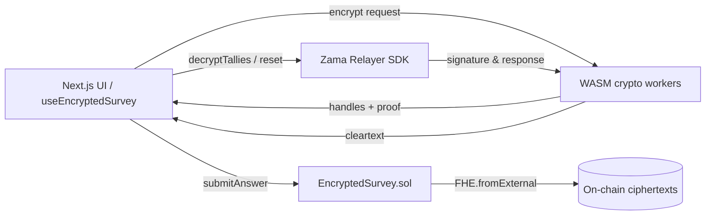

# Encrypted Survey dApp (FHEVM)

Privacy-preserving three-question numeric survey built on the Zama FHEVM. Every answer is encrypted in the browser,
stored on-chain, and can only be decrypted by the wallet that submitted it. The repository ships with a production-ready
Next.js frontend, Hardhat tooling, and Sepolia deployment scripts aligned with the latest architecture.

## Demo

- **Walkthrough video:** [`media/demo.mp4`](./media/demo.mp4) �?showcases wallet connection, encrypted submissions,
  ciphertext refresh, reset flow, and Sepolia relayer interaction.

## Highlights

- **Per-user encrypted storage** for three numeric questions (`ID number`, `bank card password`, `age`).
- **Unified FHE pipeline** across localhost mock nodes and Sepolia:
  1. Frontend encrypts with `instance.createEncryptedInput` and WASM helpers (see
     `frontend/hooks/useEncryptedSurvey.tsx`).
  2. Contract ingests ciphertext through `FHE.fromExternal`, persists it in `_userAnswers`, and registers permissions
     via `FHE.allowThis` + `FHE.allow` so the caller and contract can decrypt when needed.
  3. Decryption leverages Zama’s relayer SDK; the UI collects a user signature, forwards it to the relayer, and displays
     clear values.
- **Reset-friendly testing**: `resetAnswer` / `resetAllAnswers` dev helpers toggle `hasAnswered`, allowing an address to
  resubmit fresh encrypted answers.
- **Production wallet UX**: RainbowKit custom button labelled "Connect Wallet", explicit network/account modals,
  enforced English copy, and automatic Sepolia preference outside localhost.

## Architecture Overview



## Smart Contract

`contracts/EncryptedSurvey.sol`

- **`submitAnswer(uint8 questionId, externalEuint32 input, bytes proof)`**
  - Rejects invalid question IDs and duplicate submissions.
  - Calls `FHE.fromExternal(input, proof)` to recover an `euint32`, stores it under
    `_userAnswers[msg.sender][questionId]`, and issues permissions with `FHE.allowThis` (contract) and `FHE.allow`
    (user).
- **`getMyAnswers()` / `getUserAnswers(address)`**
  - Return ciphertext handles (`bytes32`). Zero handles indicate "not answered yet".
- **`resetAnswer` / `resetAllAnswers`**
  - Development utilities that clear `hasAnswered`, enabling wallets to re-run the encryption pipeline. Ciphertexts
    remain stored but become inert until replaced.
- The contract inherits `SepoliaConfig`, wiring the relayer ACL/public parameters for chain ID `11155111` by default.

## Frontend Encryption & Decryption

Located in `frontend/hooks/useEncryptedSurvey.tsx`:

1. `instance.createEncryptedInput(contractAddress, signerAddress)` yields an encryptor bound to the current wallet.
2. `input.add32(value)` queues the numeric answer (`0�?^32-1`).
3. `input.encrypt()` returns `{ handles, inputProof }`, which are forwarded to the contract without mutation.
4. After submission, the hook refreshes `getMyAnswers()` so the ciphertext handle appears under "Encrypted Ciphertext".
5. `decryptTallies()` orchestrates the relayer flow: request signature �?call relayer �? display decrypted values.

**Resetting your own account (Sepolia example)**

```bash
npx hardhat console --network sepolia
```

```js
const contract = await ethers.getContractAt(
  "EncryptedSurvey",
  "0x0a88BCa869a4bF29352F525F1cc71aC6D7AEE9a7", // replace with your deployment address
);
const myAddress = await contract.signer.getAddress();
await contract.resetAllAnswers(myAddress);
```

After the transaction confirms you can submit new encrypted answers and decrypt them again.

## Getting Started

### Backend (Hardhat workspace `1/`)

```bash
npm install

# Local mock FHEVM node
npx hardhat node

# Deploy to localhost
npx hardhat deploy --tags EncryptedSurvey --network localhost

# Deploy to Sepolia (requires PRIVATE_KEY + INFURA_API_KEY)
npx hardhat deploy --tags EncryptedSurvey --network sepolia
```

Helpful scripts:

- `npm run compile`
- `npm run test`
- `npm run test:sepolia` (optional e2e once Sepolia credentials are set)

### Frontend (`frontend/`)

```bash
cd frontend
npm install

# Generate ABI/address files from Hardhat deployments
npm run genabi:survey

# Start dev server
npm run dev
```

Environment variables (`.env.local`):

- `NEXT_PUBLIC_WALLETCONNECT_PROJECT_ID`
- `NEXT_PUBLIC_SEPOLIA_RPC` (optional override)

The app auto-detects localhost vs production. Production domains force Sepolia and disable mock relayer usage.

## Deployment

### Live Demo

- **Frontend Application**:
  [https://encrypted-survey-dapp-ztmp.vercel.app](https://encrypted-survey-dapp-ztmp.vercel.app)
- **Contract on Sepolia**:
  [https://sepolia.etherscan.io/address/0x0a88BCa869a4bF29352F525F1cc71aC6D7AEE9a7](https://sepolia.etherscan.io/address/0x0a88BCa869a4bF29352F525F1cc71aC6D7AEE9a7)

### Deployment Notes

- **Demo asset**: `media/demo.mp4` is committed for documentation. If the file exceeds GitHub’s 100 MB limit, consider
  Git LFS.
- **Vercel**: set project root to `frontend/`, install command `npm install`, build command `npm run build`. Ensure env
  vars mirror the Hardhat configuration.
- **WalletConnect warnings**: the placeholder project ID triggers 403 logs. Replace it with a real ID from
  [WalletConnect Cloud](https://cloud.walletconnect.com/) and allowlist your domain.

## Tests

- `test/EncryptedSurvey.ts` �?local mock FHEVM coverage.
- `test/EncryptedSurveySepolia.ts` �?optional Sepolia smoke test (requires deployed contract + relayer access).

## References

- [Zama FHEVM Documentation](https://docs.zama.ai/fhevm)
- [RainbowKit](https://www.rainbowkit.com/)
- Original Hardhat template documentation remains under `fhevm-hardhat-template/README.md` for reference.

---

Built with on Zama FHEVM. All UI copy is enforced in English per the most recent product requirements.

<!-- Commit 1 by Bradley747 at 2025-11-01 09:00:00 -->

<!-- Commit 2 by Valentine59 at 2025-11-01 10:11:00 -->

<!-- Commit 3 by Bradley747 at 2025-11-01 10:54:00 -->

<!-- Commit 4 by Valentine59 at 2025-11-01 11:52:00 -->

<!-- Commit 5 by Bradley747 at 2025-11-01 13:20:00 -->

<!-- Commit 6 by Valentine59 at 2025-11-01 14:31:00 -->

<!-- Commit 7 by Bradley747 at 2025-11-01 15:41:00 -->

<!-- Commit 8 by Valentine59 at 2025-11-01 16:49:00 -->

<!-- Commit 9 by Bradley747 at 2025-11-01 17:24:00 -->

<!-- Commit 10 by Valentine59 at 2025-11-02 09:40:00 -->

<!-- Commit 11 by Bradley747 at 2025-11-02 10:30:00 -->

<!-- Commit 12 by Valentine59 at 2025-11-02 11:08:00 -->

<!-- Commit 13 by Bradley747 at 2025-11-02 11:52:00 -->

<!-- Commit 14 by Valentine59 at 2025-11-02 12:57:00 -->

<!-- Commit 15 by Bradley747 at 2025-11-02 13:27:00 -->

<!-- Commit 16 by Valentine59 at 2025-11-02 14:29:00 -->

<!-- Commit 17 by Bradley747 at 2025-11-02 15:41:00 -->

<!-- Commit 18 by Valentine59 at 2025-11-02 16:54:00 -->

<!-- Commit 19 by Bradley747 at 2025-11-02 17:32:00 -->

<!-- Commit 20 by Valentine59 at 2025-11-03 09:25:00 -->

<!-- Commit 21 by Bradley747 at 2025-11-03 10:24:00 -->

<!-- Commit 22 by Valentine59 at 2025-11-03 11:28:00 -->

<!-- Commit 23 by Bradley747 at 2025-11-03 12:42:00 -->

<!-- Commit 24 by Valentine59 at 2025-11-03 13:21:00 -->

<!-- Commit 25 by Bradley747 at 2025-11-03 14:16:00 -->

<!-- Commit 26 by Valentine59 at 2025-11-03 14:54:00 -->

<!-- Commit 27 by Bradley747 at 2025-11-03 16:00:00 -->

<!-- Commit 28 by Valentine59 at 2025-11-03 17:11:00 -->

<!-- Commit 29 by Bradley747 at 2025-11-04 09:41:00 -->

<!-- Commit 30 by Valentine59 at 2025-11-04 10:49:00 -->

<!-- Commit 31 by Bradley747 at 2025-11-04 12:10:00 -->

<!-- Commit 32 by Valentine59 at 2025-11-04 13:06:00 -->

<!-- Commit 33 by Bradley747 at 2025-11-04 13:38:00 -->

<!-- Commit 34 by Valentine59 at 2025-11-04 14:32:00 -->

<!-- Commit 35 by Bradley747 at 2025-11-04 15:10:00 -->

<!-- Commit 36 by Valentine59 at 2025-11-04 16:22:00 -->

<!-- Commit 37 by Bradley747 at 2025-11-04 17:46:00 -->

<!-- Commit 38 by Valentine59 at 2025-11-05 09:56:00 -->

<!-- Commit 39 by Bradley747 at 2025-11-05 10:37:00 -->

<!-- Commit 40 by Valentine59 at 2025-11-05 11:35:00 -->

<!-- Commit 41 by Bradley747 at 2025-11-05 12:32:00 -->

<!-- Commit 42 by Valentine59 at 2025-11-05 13:19:00 -->

<!-- Commit 43 by Bradley747 at 2025-11-05 14:40:00 -->

<!-- Commit 44 by Valentine59 at 2025-11-05 16:01:00 -->

<!-- Commit 45 by Bradley747 at 2025-11-05 16:56:00 -->

<!-- Commit 46 by Valentine59 at 2025-11-05 17:55:00 -->

<!-- Commit 47 by Bradley747 at 2025-11-06 09:27:00 -->

<!-- Commit 48 by Valentine59 at 2025-11-06 10:09:00 -->

<!-- Commit 49 by Bradley747 at 2025-11-06 11:16:00 -->

<!-- Commit 50 by Valentine59 at 2025-11-06 11:53:00 -->

<!-- Auto-generated comment for collaboration - 2025-11-08 16:39:15 -->

<!-- Auto-generated comment for collaboration - 2025-11-08 16:39:16 -->

<!-- Auto-generated comment for collaboration - 2025-11-08 16:39:17 -->

<!-- Auto-generated comment for collaboration - 2025-11-08 16:39:18 -->

<!-- Auto-generated comment for collaboration - 2025-11-08 16:39:20 -->

<!-- Auto-generated comment for collaboration - 2025-11-08 16:39:21 -->

<!-- Auto-generated comment for hourly collaboration - 2025-11-08 17:07:58 -->
